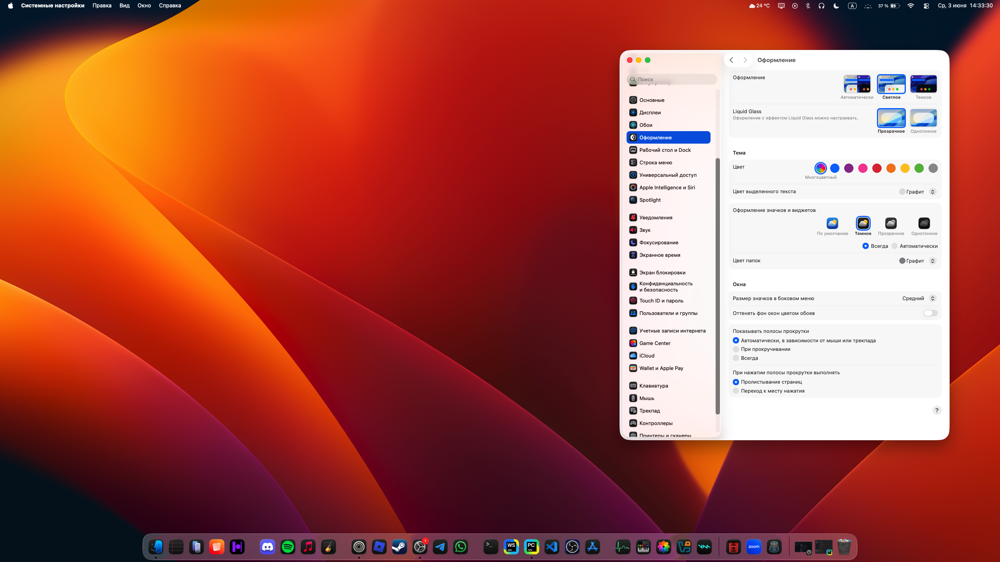

# ThemeChangerTime
light: 8:00-20:00 dark: 20:00-8:00 (you can change time if you want)

# How to install?
`download themeChangeTimeMacOs.py (MacOs version) or themeChangeTimeWin.py (Windows version) or themeChangeTimeLinux.py (Linux version)`

Open your terminal and enter the path to your script file, for example, `cd path to your script file/`
Then write

### Linux
* `nohup python3 path to your script file/themeChangeTimeLinux.py & disown`
### Windows
* `nohup python3 path to your script file/themeChangeTimeWin.py & disown`
### MacOs
* `nohup python3 path to your script file/themeChangeTimeMacOs.py & disown`

# How to stop script?

### Bash (Windows)
* `pkill -f themeChangeTimeWin.py`

### Zsh (MacOs, Linux)
* `pkill -f themeChangeTimeMacOs.py`
* `pkill -f themeChangeTimeLinux.py`
